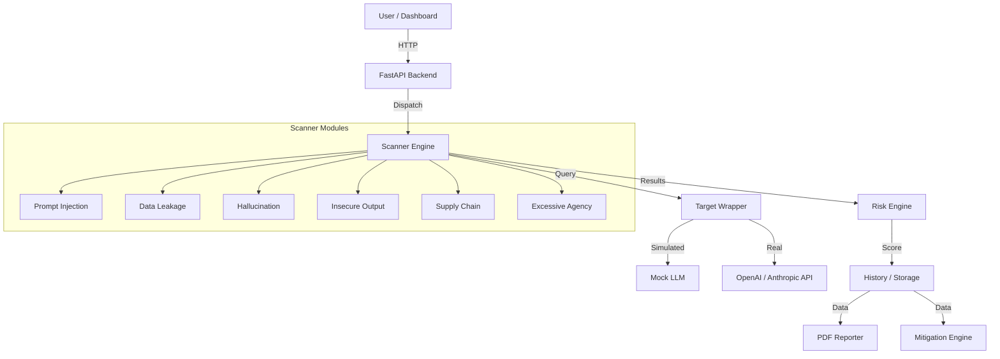

# 🛡️ LLM Vulnerability Scanner (Enterprise Edition)

[](https://opensource.org/licenses/MIT)
[](https://www.python.org/downloads/)
[](https://github.com/psf/black)
[](https://owasp.org/www-project-top-10-for-large-language-models/)

A production-grade, modular vulnerability scanner for Large Language Models (LLMs), designed to detect security risks aligned with the **OWASP Top 10 for LLMs (2025)**, **NIST AI RMF**, and **ISO/IEC 5338**.

> **⚠️ EDUCATIONAL USE ONLY**: This tool is for authorized security testing and risk assessment. Never scan systems without permission.

---

## 🚀 Features

*   **Comprehensive Coverage**: 10+ Scanner modules covering the full OWASP Top 10 for LLMs.
    *   Prompt Injection (LLM01)
    *   Insecure Output Handling (LLM02)
    *   Training Data Poisoning (LLM03)
    *   Model Denial of Service (LLM04)
    *   Supply Chain Vulnerabilities (LLM05)
    *   Sensitive Information Disclosure (LLM06)
    *   Insecure Plugin Design (LLM07)
    *   Excessive Agency (LLM08)
    *   Overreliance (LLM09)
    *   Model Theft (LLM10)
*   **Safe Simulation Mode**: Includes a `MockLLM` engine to demonstrate vulnerabilities safely without external API calls or costs.
*   **Enterprise Reporting**: Generates detailed PDF reports with executive summaries and technical findings.
*   **Risk Scoring Engine**: Automated risk calculation (0-100) based on vulnerability severity and impact.
*   **Mitigation Engine**: Provides actionable, context-aware remediation advice for every finding.
*   **Modern Dashboard**: Dark-mode, responsive web interface for real-time monitoring.
*   **API-First Design**: Fully documented REST API (FastAPI) for integration into CI/CD pipelines.

---

## 📦 Installation

### Prerequisites
*   Python 3.9 or higher
*   `pip` package manager

### Quick Start

1.  **Clone the repository**
    ```bash
    git clone https://github.com/llm-security/vuln-scanner.git
    cd llm-vuln-scanner
    ```

2.  **Run the setup script** (Mac/Linux)
    ```bash
    ./run.sh
    ```
    *This script creates a virtual environment, installs dependencies, starts the backend, and opens the dashboard.*

### Docker Deployment (Recommended)

1.  **Build and Run with Docker Compose**
    ```bash
    docker-compose up --build
    ```
    The API will be available at `http://localhost:8000` and the frontend at `http://localhost:8080`.

### Manual Installation

1.  **Create virtual environment**
    ```bash
    python3 -m venv venv
    source venv/bin/activate
    ```

2.  **Install dependencies**
    ```bash
    pip install -r requirements.txt
    ```

---

## 🏃‍♂️ Usage

### Starting the Backend
```bash
cd backend
uvicorn main:app --reload --host 0.0.0.0 --port 8000
```
The API will be available at `http://localhost:8000`.
Swagger documentation: `http://localhost:8000/docs`.

### Using the Dashboard
Open `frontend/index.html` in your browser.
*   **Start Scan**: Click the "Start New Scan" button to trigger a simulation.
*   **View Results**: Real-time logs and detailed findings table.
*   **Export Report**: Download PDF reports of completed scans.

### Running Tests
```bash
make test
```

---

## 🏗️ Architecture



### Key Components

*   **`backend/engines/`**: Core logic for vulnerability detection.
*   **`backend/api/`**: REST endpoints.
*   **`backend/utils/`**: Helpers for logging, PDF generation, etc.
*   **`frontend/`**: Vanilla JS/CSS dashboard.

---

## 🛡️ Security & Ethics

This tool is built with safety in mind:
1.  **Mock Mode by Default**: Prevents accidental API usage.
2.  **Synthetic Payloads**: Uses safe, educational examples rather than real exploits.
3.  **No Malicious Code**: Does not generate or execute actual malware.

**Disclaimer**: The maintainers are not responsible for misuse. Ensure you comply with the [Australian Privacy Act 1988](https://www.legislation.gov.au/Details/C2022C00292) and relevant cybercrime legislation when using this tool.

---

## 🤝 Contributing

We welcome contributions! Please see [CONTRIBUTING.md](CONTRIBUTING.md) for guidelines.

## 📄 License

This project is licensed under the MIT License - see the [LICENSE](LICENSE) file for details.
